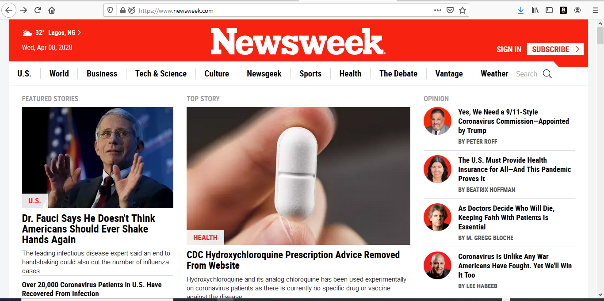
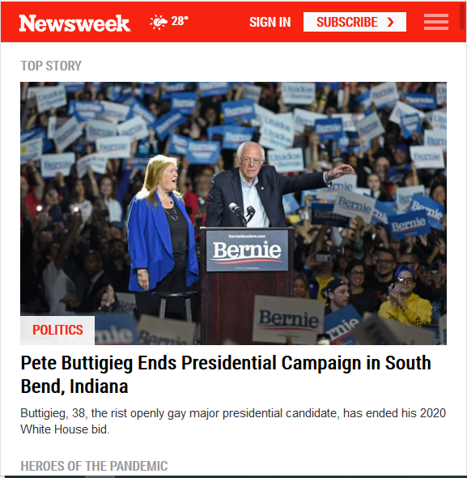
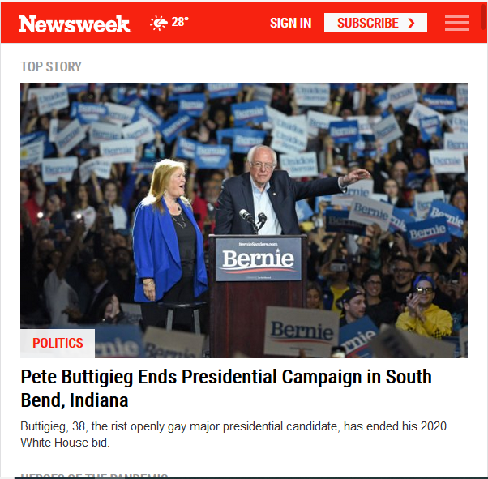
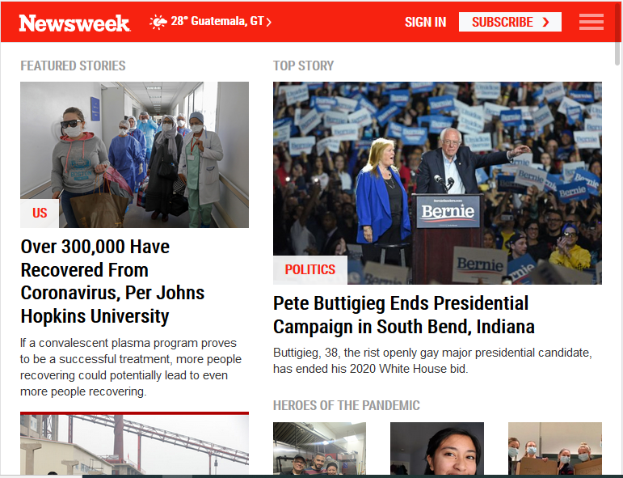
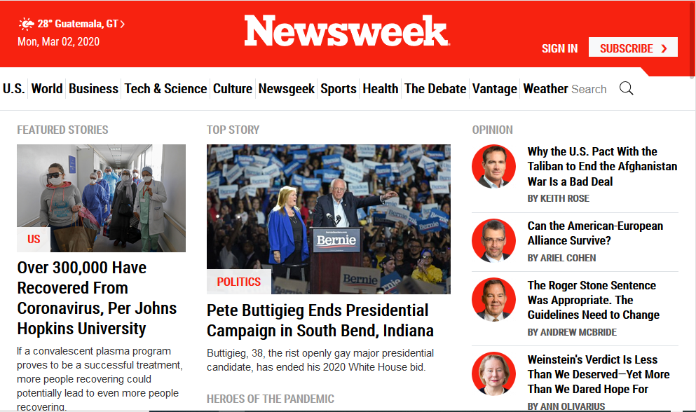
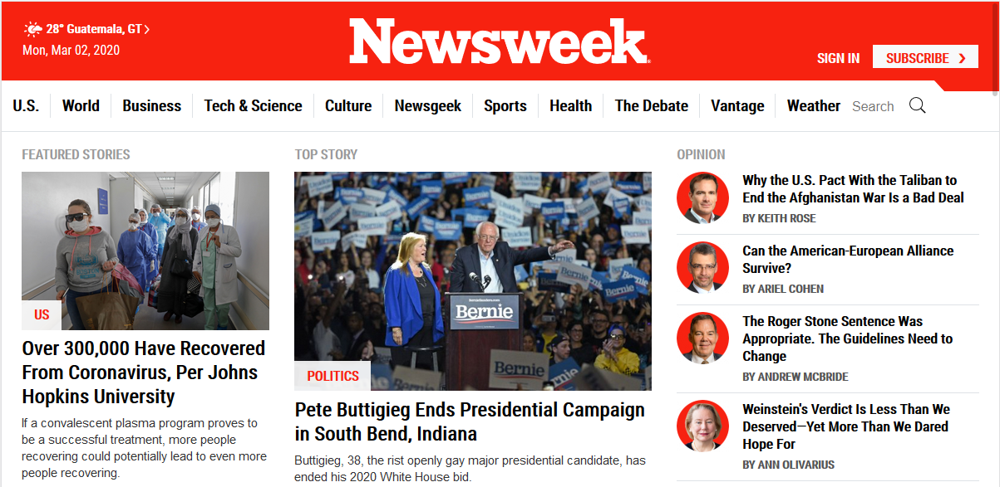

# The Next Web

## Project Description

This project requires me to replicate the responsiveness of the homepage of the Newsweek.com (https://www.newsweek.com/) that will be responsive across different screen sizes using the Bootstrap 4 framework.

## How it was Implemented

The project was implemented using the mobile-first approach which ensure that the page display perfectly on mobile devices. This approach makes it easy to design for higher screen sizes. The range of screen sizes taking into consideration are extra small, small, medium, large and extra large devices.

The main layout was mainly designed with the use of Bootstrap 4's grid system which consists of a 12-column grid system. Then the various sections and components of the page were majorly implemented  with the use of the numerous classes of the Bootstrap 4 framework.

## For extra small devices with a viewport less than 576px

## For small devices with a viewport greater than or equals to 576px

## For medium devices with a viewport greater than or equals to 768px

## For large devices with a viewport greater than or equals to 992px

## For extra large devices with a viewport greater than or equals to 1200px

Please checkout the live version of our project [here](https://raw.githack.com/adewaleK/newsweek/responsive-bootstrap/index.html)

## Built With

* HTML
* CSS
* BOOTSTRAP 4
* VSCode
* Google fonts

## Author

👤 **Adewale kamilu A**  
* Github: [@githubhandle](https://github.com/adewaleK)
* Twitter: [@twitterhandle](https://twitter.com/twitterhandle)
* Linkedin: [linkedin](https://linkedin.com/linkedinhandle)

## 🤝 Contributing

Contributions, issues and feature requests are welcome!
Feel free to check the [issues page](issues/).
